# Desafio Virtualbox e Vagrant

Repositório para salvar as evidências referentes ao desafio de Virtualbox e Vagrant do Bootcamp de DevOps da Atlântico Avanti.

**Autor**: Sylvio Castanho Jr.

## 1 Vagrant init

Após execução do comando `vagrant init`, o arquivo Vagrantfile foi criado:

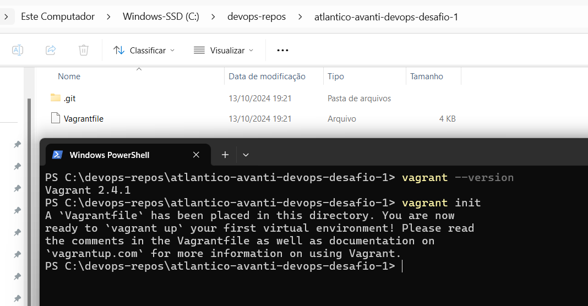


<details>

<summary>Conteúdo inicial do Vagrantfile (clique na setinha para expandir)</summary>


```ruby
# -*- mode: ruby -*-
# vi: set ft=ruby :

# All Vagrant configuration is done below. The "2" in Vagrant.configure
# configures the configuration version (we support older styles for
# backwards compatibility). Please don't change it unless you know what
# you're doing.
Vagrant.configure("2") do |config|
  # The most common configuration options are documented and commented below.
  # For a complete reference, please see the online documentation at
  # https://docs.vagrantup.com.

  # Every Vagrant development environment requires a box. You can search for
  # boxes at https://vagrantcloud.com/search.
  config.vm.box = "base"

  # Disable automatic box update checking. If you disable this, then
  # boxes will only be checked for updates when the user runs
  # `vagrant box outdated`. This is not recommended.
  # config.vm.box_check_update = false

  # Create a forwarded port mapping which allows access to a specific port
  # within the machine from a port on the host machine. In the example below,
  # accessing "localhost:8080" will access port 80 on the guest machine.
  # NOTE: This will enable public access to the opened port
  # config.vm.network "forwarded_port", guest: 80, host: 8080

  # Create a forwarded port mapping which allows access to a specific port
  # within the machine from a port on the host machine and only allow access
  # via 127.0.0.1 to disable public access
  # config.vm.network "forwarded_port", guest: 80, host: 8080, host_ip: "127.0.0.1"

  # Create a private network, which allows host-only access to the machine
  # using a specific IP.
  # config.vm.network "private_network", ip: "192.168.33.10"

  # Create a public network, which generally matched to bridged network.
  # Bridged networks make the machine appear as another physical device on
  # your network.
  # config.vm.network "public_network"

  # Share an additional folder to the guest VM. The first argument is
  # the path on the host to the actual folder. The second argument is
  # the path on the guest to mount the folder. And the optional third
  # argument is a set of non-required options.
  # config.vm.synced_folder "../data", "/vagrant_data"

  # Disable the default share of the current code directory. Doing this
  # provides improved isolation between the vagrant box and your host
  # by making sure your Vagrantfile isn't accessible to the vagrant box.
  # If you use this you may want to enable additional shared subfolders as
  # shown above.
  # config.vm.synced_folder ".", "/vagrant", disabled: true

  # Provider-specific configuration so you can fine-tune various
  # backing providers for Vagrant. These expose provider-specific options.
  # Example for VirtualBox:
  #
  # config.vm.provider "virtualbox" do |vb|
  #   # Display the VirtualBox GUI when booting the machine
  #   vb.gui = true
  #
  #   # Customize the amount of memory on the VM:
  #   vb.memory = "1024"
  # end
  #
  # View the documentation for the provider you are using for more
  # information on available options.

  # Enable provisioning with a shell script. Additional provisioners such as
  # Ansible, Chef, Docker, Puppet and Salt are also available. Please see the
  # documentation for more information about their specific syntax and use.
  # config.vm.provision "shell", inline: <<-SHELL
  #   apt-get update
  #   apt-get install -y apache2
  # SHELL
end
```

</details>

## 2 VM Box

Foi feita uma alteração na linha `config.vm.box = "base"` para utilizar a box [Ubuntu Focal64](https://app.vagrantup.com/ubuntu/boxes/focal64):

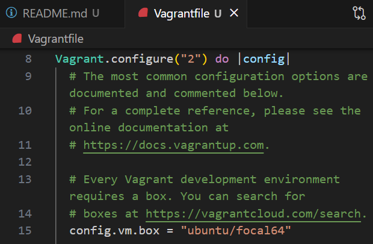

## 3 Network

Foi feita uma alteração na linha 40, onde ela foi descomentada para permitir que uma nova placa de rede seja criada em modo "brigde":

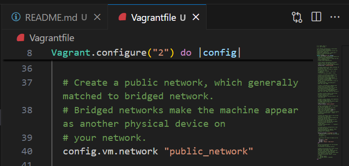

## 4 Configurações da VM

Foram realizadas as configurações personalizadas da máquina virtual:

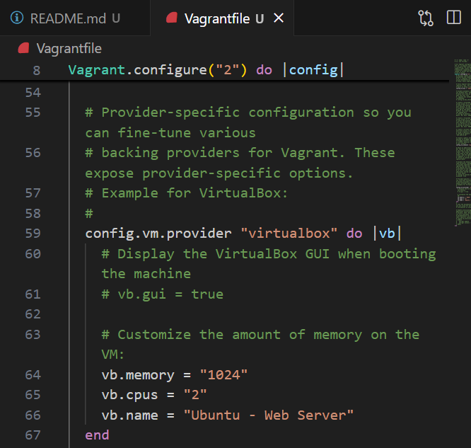

## 5 Inicialização da VM

Foi executado o comando `vagrant up` para iniciar a máquina virtual e esse foi o resultado:

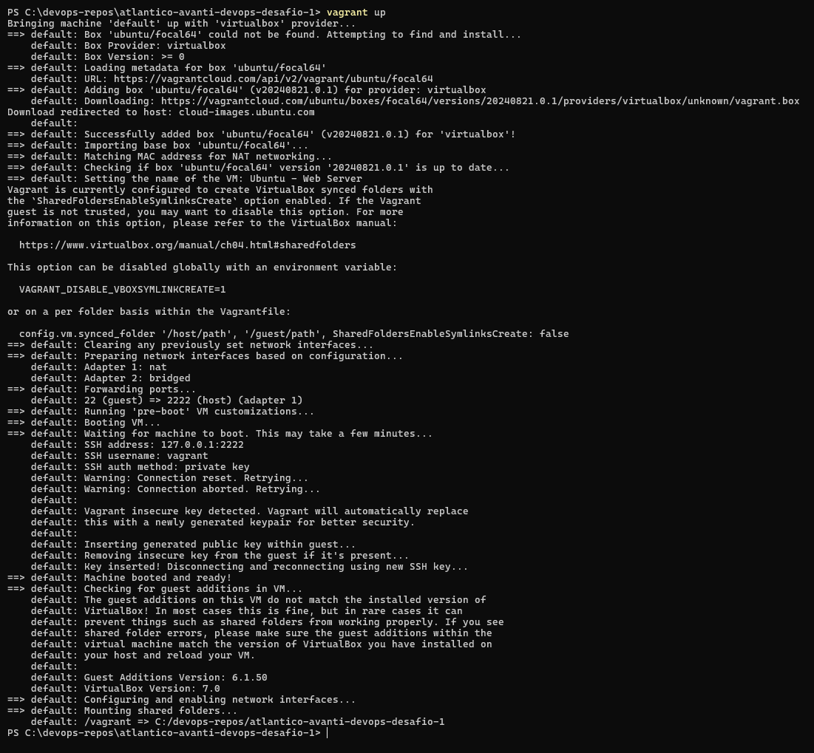

## 6 Conexão com a VM

Foi feito o acesso remoto na maquina virtual com o comando `vagrant ssh`

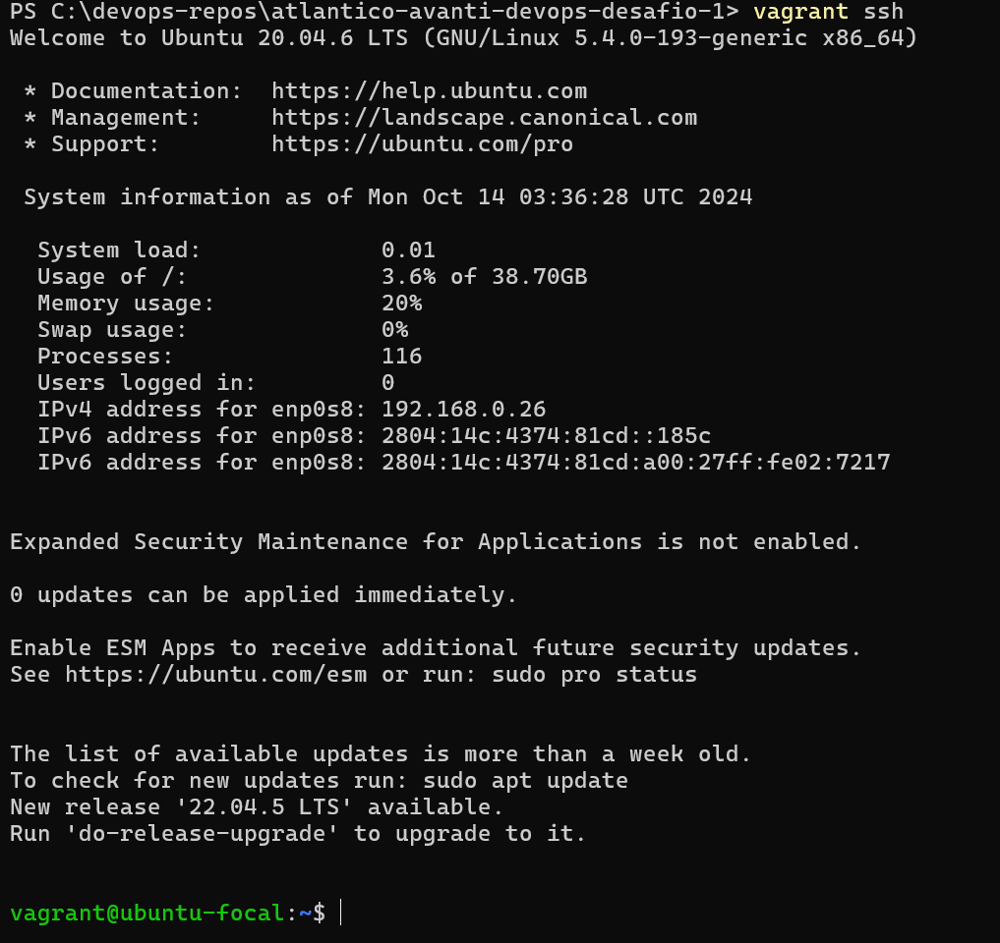

## 7 Atualização do sistema da VM

Foram feitas as atualizações do sistema operacional e bibliotecas utilizando os seguintes comandos:


```bash
sudo apt-get update
sudo apt-get upgrade -y
```

Abaixo o print das últimas linhas:

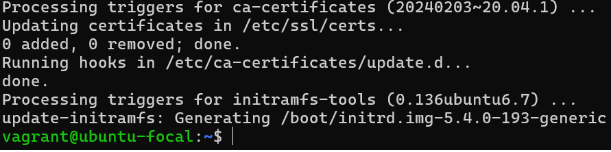

## 8 Instalação do Apache

Foi feita a instalação do apache com os comandos abaixo:
 
```bash
sudo apt-get install apache2 -y
systemctl status apache2
```
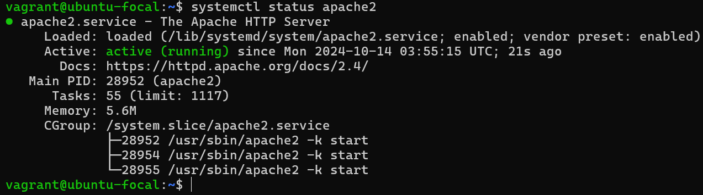

## 9 Clone da aplicação

Foi utilizado o clone da aplicação no projeto como segue o comando:

```bash
sudo git clone https://github.com/luizcarlos16/mundo-invertido.git

```
E os arquivos da aplicação foram copiados para pasta padrão do Apache:

```bash
cd mundo-invertido
sudo cp * -R /var/www/html
```
Abaixo o resultado:

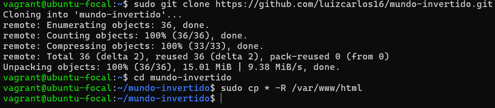

## 10 Acesso a aplicação

Inicialmente verificou-se o ip da máquina virtual com os seguintes comandos:

```bash
ip a
```
O IP verificado foi 192.168.0.26:

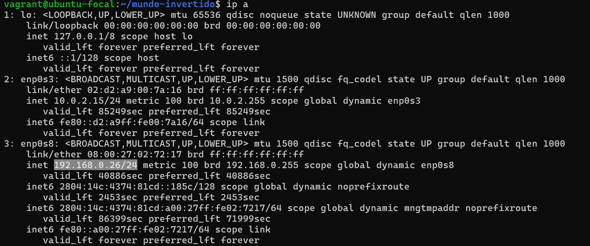

E a aplicação ficou disponível através do webserver Apache e do network no modo bridge acessando por esse IP, conforme a imagem abaixo:

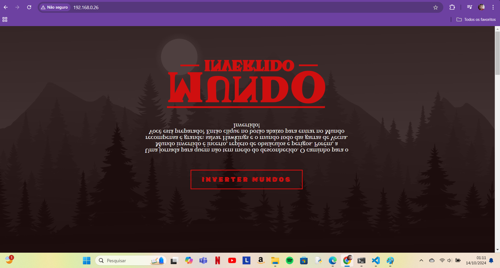


## 11 Desligando a VM

Utilizei os comandos abaixo para se desconectar da VM, desligá-la e destruí-la.

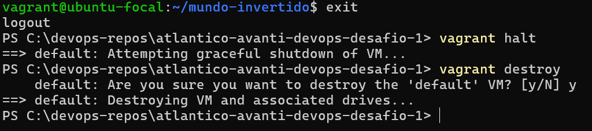

